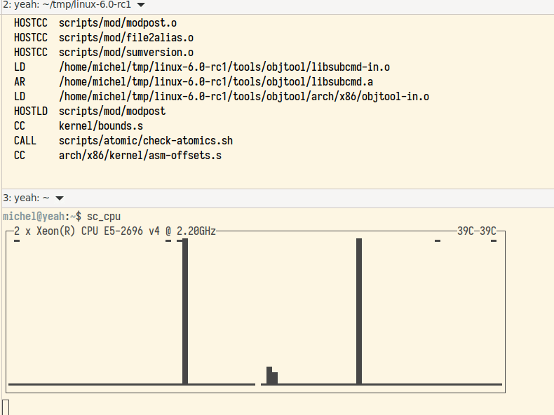

# libsc

This is some sort of lightweight 'libncurses' mostly made (so far) to display tables and such.
Only 'documentation' so far is the example programs. It is pretty simple tho.

The library 'compiles' itself as a single header file *sc.h* OR, as a static/dynamic library. the single file is inspired by the *stb_*.h* files, and are quite handy to make tools with less dependencies.

The static/dyn libraries are probably better for debugging, and for full install where size of the binary matters.

## What works
* printf like
* 'goto' X,Y
* windows and sub windows
* 'boxes' square and rounded
* UTF8 output
* VT100 attribute parsing, and 256 colors in/out
* "Rendering" and count lines
* "Update" current version on screen, ie move cursor back and redisplay
* Single key input, with timeout
* (sub) Window text justification

## TODO:
* 'diff' one output with the previous one
* UTF8 input
* vt100 RGB support?
* Add some sort of *table* and *column* support

## Notes:
* You need *tcc* (Fabrice Bellard tiny C runtime) to build sc.h. If you don't know about *tcc*, you should!

